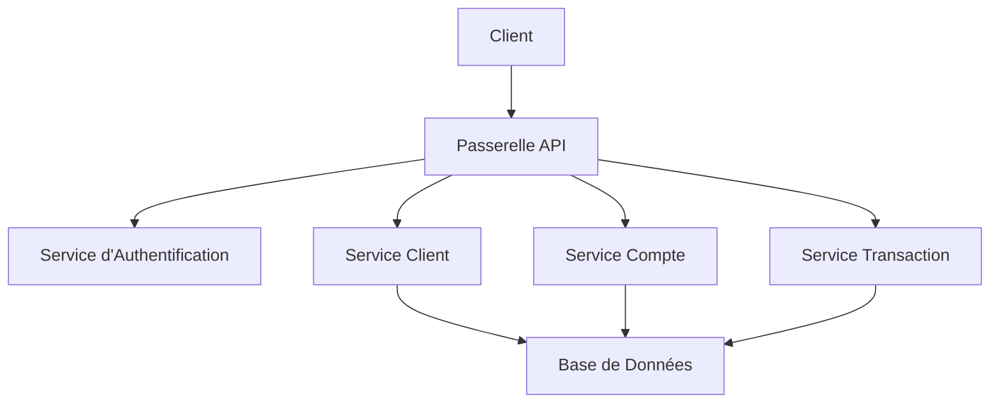
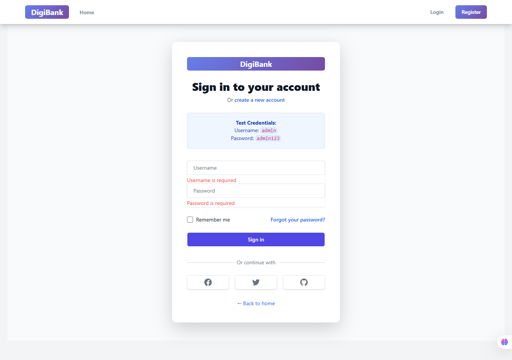
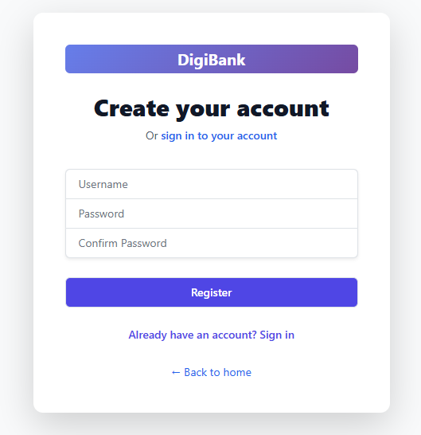
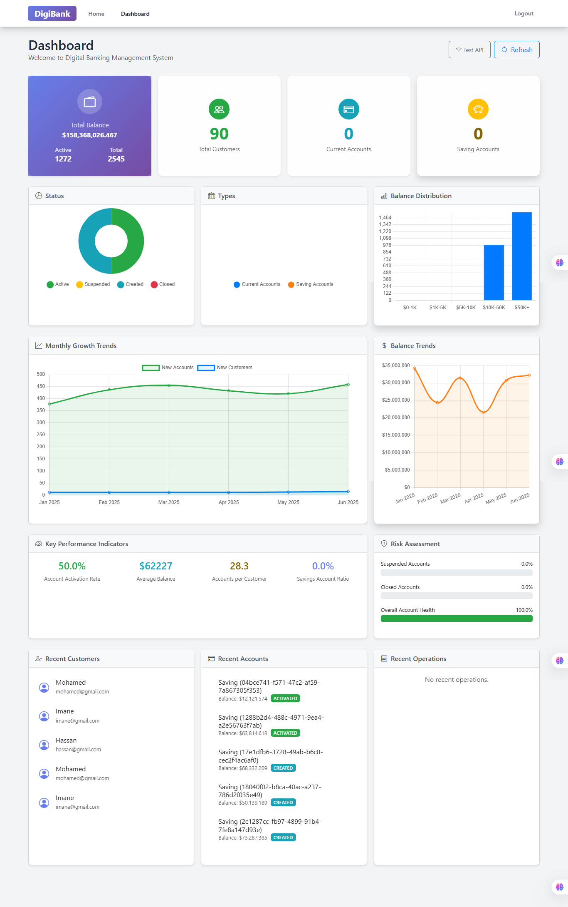
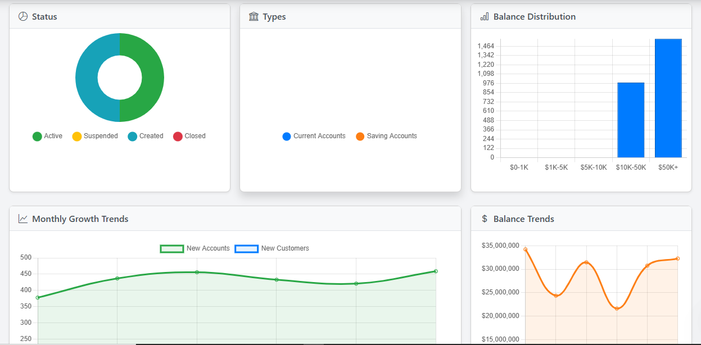
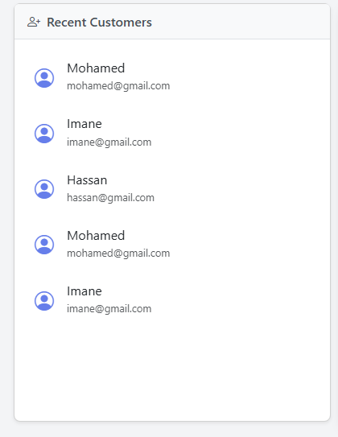
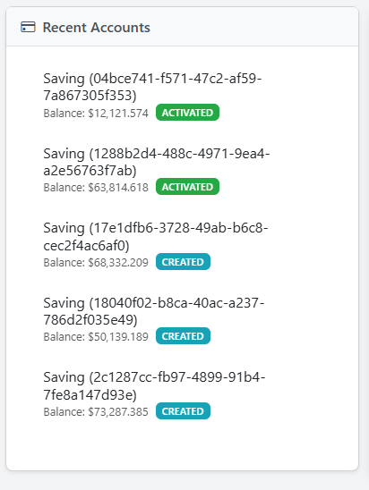
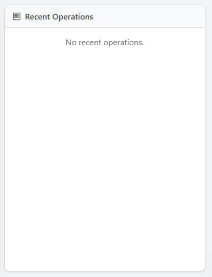
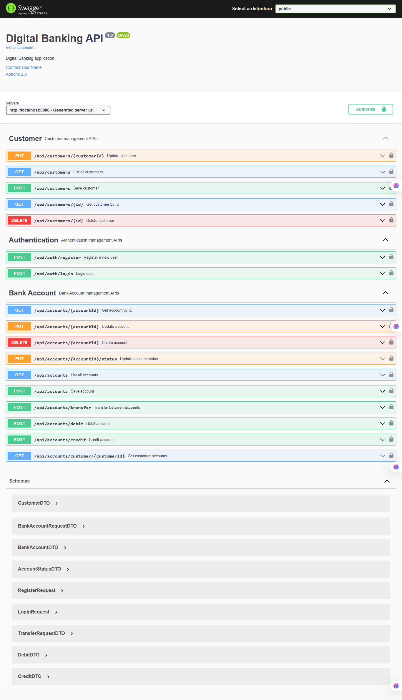

# Application Bancaire Numérique - DigiBank: Rapport Mabchour Abderrahmane

Ce rapport fournit une vue détaillée de l'application bancaire numérique DigiBank, couvrant à la fois ses composants frontend et backend. Il met en évidence l'architecture, la pile technologique, les fonctionnalités principales, des exemples de code clés, et inclut des sections pour la documentation visuelle via des captures d'écran.

## Table des Matières

1. [Vue d'ensemble du Projet](#1-vue-densemble-du-projet)
2. [Architecture](#2-architecture)
   - [Conception du Système Backend](#conception-du-système-backend)
   - [Architecture des Composants Backend](#architecture-des-composants-backend)
3. [Pile Technologique](#3-pile-technologique)
   - [Technologies et Dépendances Backend](#technologies-et-dépendances-backend)
   - [Pile Technique Frontend](#pile-technique-frontend)
4. [Fonctionnalités Principales](#4-fonctionnalités-principales)
   - [Système d'Authentification](#système-dauthentification)
   - [Gestion des Clients](#gestion-des-clients)
   - [Gestion des Comptes](#gestion-des-comptes)
   - [Gestion des Opérations](#gestion-des-opérations)
   - [Tableau de Bord et Analyses](#tableau-de-bord-et-analyses)
   - [Composants Partagés](#composants-partagés)
   - [Fonctionnalités de Sécurité](#fonctionnalités-de-sécurité)
5. [Exemples de Code Importants](#5-exemples-de-code-importants)
   - [Classes d'Entités Backend](#classes-dentités-backend)
     - [Entité Client](#entité-client)
     - [Entité Compte Bancaire](#entité-compte-bancaire)
     - [Entité Compte Courant](#entité-compte-courant)
     - [Entité Compte Épargne](#entité-compte-épargne)
     - [Entité Opération de Compte](#entité-opération-de-compte)
   - [DTOs Backend (Objets de Transfert de Données)](#dtos-backend-objets-de-transfert-de-données)
     - [CustomerDTO (Backend)](#customerdto-backend)
     - [BankAccountDTO (Backend)](#bankaccountdto-backend)
   - [Contrôleurs Backend (Exemple: CustomerController)](#contrôleurs-backend-exemple-customercontroller)
   - [Services Frontend (Exemple: Service d'Authentification)](#services-frontend-exemple-service-dauthentification)
   - [Composants Frontend (Exemples: Gestion des Clients, Opérations de Compte)](#composants-frontend-exemples-gestion-des-clients-opérations-de-compte)
6. [Captures d'Écran de l'Application](#6-captures-décran-de-lapplication)
   - [Pages d'Authentification](#pages-dauthentification)
     - [Capture d'écran de la page de connexion](#capture-décran-de-la-page-de-connexion)
     - [Capture d'écran de la page d'inscription](#capture-décran-de-la-page-dinscription)
   - [Tableau de Bord](#tableau-de-bord)
     - [Capture d'écran du tableau de bord principal](#capture-décran-du-tableau-de-bord-principal)
     - [Capture d'écran du tableau de bord analytique](#capture-décran-du-tableau-de-bord-analytique)
   - [Gestion des Clients](#gestion-des-clients-1)
     - [Capture d'écran de la liste des clients](#capture-décran-de-la-liste-des-clients)
   - [Gestion des Comptes](#gestion-des-comptes-1)
     - [Capture d'écran de la liste des comptes](#capture-décran-de-la-liste-des-comptes)
   - [Gestion des Opérations](#gestion-des-opérations-1)
     - [Capture d'écran de l'historique des opérations d'un compte](#capture-décran-de-lhistorique-des-opérations-dun-compte)

## 1. Vue d'ensemble du Projet

### Vue d'ensemble du Backend

Le Backend de l'Application Bancaire Numérique est une application bancaire robuste qui fournit une gestion sécurisée et efficace des opérations bancaires. Le système implémente des pratiques de sécurité modernes et suit les principes de l'architecture microservices.

**Fonctionnalités Clés (Backend)**:

- Authentification et Autorisation des Utilisateurs
- Gestion des Clients
- Gestion des Comptes Bancaires
- Traitement des Transactions
- Suivi de l'Historique des Comptes
- Contrôle d'Accès Basé sur les Rôles
- Documentation API avec Swagger

### Vue d'ensemble du Frontend

Le Frontend de l'Application Bancaire Numérique est une application web moderne et responsive construite avec Angular qui offre une solution bancaire complète. L'application propose une interface conviviale pour gérer les comptes bancaires, les clients et les opérations financières.

## 2. Architecture

### Conception du Système Backend



### Architecture des Composants Backend

- **Couche API**: Points de terminaison RESTful
- **Couche Service**: Implémentation de la logique métier
- **Couche Repository**: Accès aux données
- **Couche Sécurité**: Authentification et autorisation JWT

## 3. Pile Technologique

### Technologies et Dépendances Backend

- Java 17
- Spring Boot 3.x
- Spring Security
- Spring Data JPA
- Base de Données MySQL
- Maven
- JWT pour l'Authentification
- Swagger/OpenAPI pour la Documentation

**Dépendances (Exemple depuis `pom.xml`)**:

```xml
<dependencies>
    <!-- Spring Boot Starters -->
    <dependency>
        <groupId>org.springframework.boot</groupId>
        <artifactId>spring-boot-starter-web</artifactId>
    </dependency>
    <dependency>
        <groupId>org.springframework.boot</groupId>
        <artifactId>spring-boot-starter-data-jpa</artifactId>
    </dependency>
    <dependency>
        <groupId>org.springframework.boot</groupId>
        <artifactId>spring-boot-starter-security</artifactId>
    </dependency>

    <!-- Base de Données -->
    <dependency>
        <groupId>com.mysql</groupId>
        <artifactId>mysql-connector-j</artifactId>
    </dependency>

    <!-- JWT -->
    <dependency>
        <groupId>io.jsonwebtoken</groupId>
        <artifactId>jjwt-api</artifactId>
    </dependency>

    <!-- Swagger -->
    <dependency>
        <groupId>org.springdoc</groupId>
        <artifactId>springdoc-openapi-starter-webmvc-ui</artifactId>
    </dependency>
</dependencies>
```

### Pile Technique Frontend

- **Framework**: Angular (Dernière Version)
- **Styling**: Tailwind CSS
- **Gestion d'État**: Services Angular
- **Client HTTP**: Angular HttpClient
- **Authentification**: Authentification basée sur JWT
- **Composants UI**: Composants personnalisés avec Tailwind CSS

## 4. Fonctionnalités Principales

### Système d'Authentification

- **Inscription Utilisateur**
  - Inscription avec nom d'utilisateur et mot de passe
  - Validation de formulaire
  - Notifications de succès/erreur
- **Connexion Utilisateur**
  - Authentification sécurisée
  - Gestion des tokens JWT
  - Persistance de session
  - Rafraîchissement automatique des tokens

### Gestion des Clients

- **Opérations sur les Clients**
  - Création de nouveaux clients
  - Affichage de la liste des clients
  - Mise à jour des informations client
  - Suppression de clients
  - Fonctionnalité de recherche
  - Support de la pagination
- **Modèle de Données Client**
  ```typescript
  interface Customer {
    id: number;
    name: string;
    email: string;
  }
  ```

### Gestion des Comptes

- **Types de Comptes**
  - Comptes Courants
  - Comptes Épargne
  - Suivi de l'état des comptes (Actif, Suspendu, Fermé)
- **Fonctionnalités des Comptes**
  - Création de compte
  - Gestion du solde
  - Configuration du taux d'intérêt
  - Facilité de découvert
  - Gestion de l'état du compte

### Gestion des Opérations

- **Types de Transactions**
  - Opérations de débit
  - Opérations de crédit
  - Opérations de transfert
- **Fonctionnalités des Opérations**
  - Mise à jour en temps réel du solde
  - Historique des transactions
  - Validation des opérations
  - Vérification du montant
  - Support de la description

### Tableau de Bord et Analyses

- **Indicateurs Clés**
  - Nombre total de clients
  - Nombre total de comptes
  - Comptes actifs
  - Solde total
  - Distribution des types de comptes
  - Solde moyen
  - Taux d'activation

### Composants Partagés

- **Indicateur de Chargement**
  - Retour visuel pendant les opérations
  - États de chargement cohérents
- **Modal de Confirmation**
  - Dialogues de confirmation d'action
  - Messages personnalisables
  - Actions Oui/Non
- **Pagination**
  - Navigation entre les pages
  - Sélection du nombre d'éléments par page
  - Affichage du nombre total d'éléments

### Fonctionnalités de Sécurité

- **Authentification**
  - Authentification basée sur les tokens JWT
  - Stockage sécurisé des tokens
  - Rafraîchissement automatique des tokens
  - Routes protégées
- **Protection des Données**
  - Validation des formulaires
  - Assainissement des entrées
  - Gestion des erreurs
  - Requêtes HTTP sécurisées

## 5. Exemples de Code Importants

### Classes d'Entités Backend

#### Entité Client

```java
@Entity
@Data
@NoArgsConstructor
@AllArgsConstructor
public class Customer {
    @Id
    @GeneratedValue(strategy = GenerationType.IDENTITY)
    private Long id;
    private String name;
    private String email;
    private String phone;

    @OneToMany(mappedBy = "customer")
    private List<BankAccount> bankAccounts;
}
```

#### Entité Compte Bancaire

```java
@Entity
@Data
@NoArgsConstructor
@AllArgsConstructor
@Inheritance(strategy = InheritanceType.SINGLE_TABLE)
@DiscriminatorColumn(name = "TYPE", length = 4)
public abstract class BankAccount {
    @Id
    private String id;
    private double balance;
    private Date createdAt;

    @ManyToOne
    private Customer customer;

    @OneToMany(mappedBy = "bankAccount")
    private List<AccountOperation> accountOperations;
}
```

#### Entité Compte Courant

```java
@Entity
@Data
@NoArgsConstructor
@DiscriminatorValue("CURR")
public class CurrentAccount extends BankAccount {
    private double overDraft;
}
```

#### Entité Compte Épargne

```java
@Entity
@Data
@NoArgsConstructor
@DiscriminatorValue("SAV")
public class SavingAccount extends BankAccount {
    private double interestRate;
}
```

#### Entité Opération de Compte

```java
@Entity
@Data
@NoArgsConstructor
@AllArgsConstructor
public class AccountOperation {
    @Id
    @GeneratedValue(strategy = GenerationType.IDENTITY)
    private Long id;
    private Date operationDate;
    private double amount;
    private String description;
    private OperationType type;

    @ManyToOne
    private BankAccount bankAccount;
}
```

### DTOs Backend (Objets de Transfert de Données)

#### CustomerDTO (Backend)

```java
@Data
public class CustomerDTO {
    private Long id;
    private String name;
    private String email;
    private String phone;
    private List<BankAccountDTO> bankAccounts;
}
```

#### BankAccountDTO (Backend)

```java
@Data
public class BankAccountDTO {
    private String id;
    private double balance;
    private String customerName;
    private String accountType;
}
```

### Contrôleurs Backend (Exemple: CustomerController)

```java
@RestController
@RequestMapping("/api/customers")
@SecurityRequirement(name = "bearerAuth")
public class CustomerController {
    @Autowired
    private CustomerService customerService;

    @GetMapping
    @PreAuthorize("hasRole('ADMIN')")
    public List<CustomerDTO> customers() {
        return customerService.listCustomers();
    }

    @GetMapping("/{id}")
    @PreAuthorize("hasRole('ADMIN')")
    public CustomerDTO getCustomer(@PathVariable(name = "id") Long customerId) {
        return customerService.getCustomer(customerId);
    }

    @PostMapping
    @PreAuthorize("hasRole('ADMIN')")
    public CustomerDTO saveCustomer(@RequestBody CustomerDTO customerDTO) {
        return customerService.saveCustomer(customerDTO);
    }
}
```

### Services Frontend (Exemple: Service d'Authentification)

```typescript
@Injectable({
  providedIn: "root",
})
export class AuthService {
  private readonly API_URL = "http://localhost:8080/api";
  private readonly TOKEN_KEY = "auth_token";
  private readonly USER_KEY = "user_data";

  constructor(private http: HttpClient) {}

  login(loginData: LoginRequest): Observable<AuthResponse> {
    return this.http.post<AuthResponse>(`${this.API_URL}/auth/login`, loginData).pipe(tap((response) => this.handleAuthResponse(response)));
  }

  isAuthenticated(): boolean {
    return !!this.getToken();
  }
}
```

### Composants Frontend (Exemples: Gestion des Clients, Opérations de Compte)

#### Composant de Gestion des Clients

```typescript
@Component({
  selector: "app-customers-list",
  standalone: true,
  imports: [CommonModule, RouterModule, FormsModule, LoadingSpinnerComponent, ConfirmationModalComponent, PaginationComponent],
  templateUrl: "./customers-list.component.html",
})
export class CustomersListComponent implements OnInit {
  customers: Customer[] = [];
  loading = false;
  searchKeyword = "";

  // Propriétés de pagination
  currentPage = 0;
  totalPages = 0;
  pageSize = 10;
}
```

#### Composant d'Opérations de Compte

```typescript
@Component({
  selector: "app-account-operations",
  standalone: true,
  imports: [CommonModule, RouterModule, ReactiveFormsModule, LoadingSpinnerComponent, PaginationComponent],
})
export class AccountOperationsComponent implements OnInit {
  accountId: string = "";
  account: BankAccount | null = null;
  accountHistory: AccountHistory | null = null;
  operations: AccountOperation[] = [];

  operationForm: FormGroup;
  loading: boolean = false;
}
```

## 6. Captures d'Écran de l'Application

### Pages d'Authentification

#### Capture d'écran de la page de connexion



- Interface de connexion propre et moderne
- Champs nom d'utilisateur et mot de passe
- Option « Se souvenir de moi »
- Lien « Mot de passe oublié »

#### Capture d'écran de la page d'inscription



- Formulaire d'inscription utilisateur
- Indicateur de robustesse du mot de passe
- Case à cocher pour accepter les conditions générales
- Retour visuel sur la validation

### Tableau de Bord

#### Capture d'écran du tableau de bord principal



- Vue d'ensemble des indicateurs clés
- Transactions récentes
- Soldes des comptes
- Boutons d'actions rapides

#### Capture d'écran du tableau de bord analytique



- Graphiques détaillés sur l'état des comptes, le type, la distribution des soldes et les tendances

### Gestion des Clients

#### Capture d'écran de la liste des clients



- Liste de tous les clients avec recherche et pagination

### Gestion des Comptes

#### Capture d'écran de la liste des comptes



- Liste de tous les comptes bancaires avec détails

### Gestion des Opérations

#### Capture d'écran de l'historique des opérations d'un compte



- Affiche l'historique des transactions pour un compte spécifique

## Documentation API avec Swagger

L'application DigiBank utilise **Swagger/OpenAPI** pour la documentation interactive de ses API REST. Cela permet aux développeurs et testeurs d'explorer, de tester et de comprendre facilement les différents endpoints exposés par le backend.

### Configuration Swagger (Spring Boot)

Exemple d'ajout de dépendance dans `pom.xml` :

```xml
<dependency>
    <groupId>org.springdoc</groupId>
    <artifactId>springdoc-openapi-starter-webmvc-ui</artifactId>
    <version>2.0.2</version>
</dependency>
```

Aucune configuration supplémentaire n'est nécessaire avec Spring Boot 3.x et `springdoc-openapi`. L'interface Swagger UI est automatiquement disponible.

### Accès à la documentation

- URL locale : [http://localhost:8080/swagger-ui.html](http://localhost:8080/swagger-ui.html)

### Exemple d'interface Swagger UI



- Visualisation de tous les endpoints REST
- Test interactif des requêtes (GET, POST, etc.)
- Affichage des schémas de données et des réponses attendues

## Conclusion

L'application DigiBank démontre une solution bancaire numérique robuste et moderne, utilisant Angular pour le frontend et Spring Boot pour le backend. Son architecture modulaire, son ensemble complet de fonctionnalités et son design convivial en font un candidat solide pour les applications bancaires réelles. L'intégration d'une authentification sécurisée, de la visualisation des données en temps réel et d'un design responsive assure une expérience utilisateur fluide. Avec des améliorations supplémentaires en matière d'optimisation des performances, d'accessibilité et d'internationalisation, DigiBank est bien positionné pour répondre aux demandes évolutives de la banque numérique.
